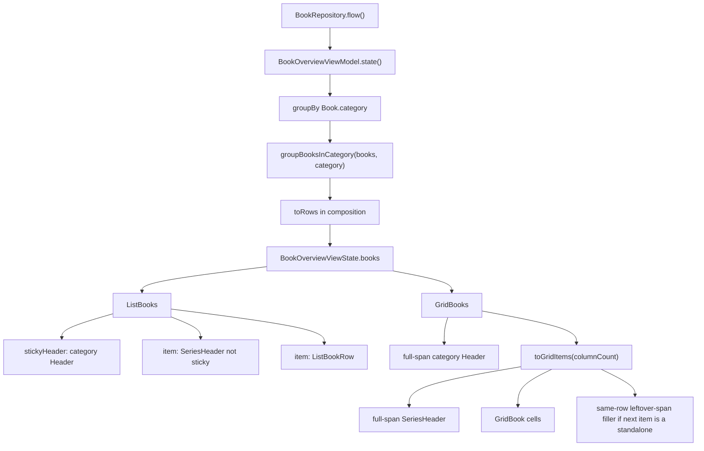
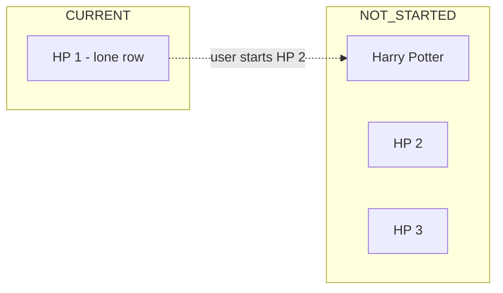

# Library Series Grouping Design

| Field | Value |
| --- | --- |
| **Title** | Library Series Grouping |
| **Author** | Krishna / Voice |
| **Date** | 2026-08-09 |
| **Status** | Draft |
| **Module** | `:features:bookOverview` |
| **Target branch** | `personal` (PRs target `personal`, do not merge) |

---

## Overview

The library overview (`:features:bookOverview`) currently partitions books into three flat categories — Current, Not started, Completed — then sorts each category with `BookComparator`. Series/part can already be stored on `BookContent` (ID3 `TXXX` `MVNM`/`MVIN` at **first insert**), but the UI ignores those fields, so a 7-book series is scattered by last-played or name.

This change groups books that share a series **inside each existing category**. A series with two or more books in the same category becomes one sorted cluster under a non-sticky subheader; a lone tagged book and every standalone stay as normal rows. Search, playback, widget, Android Auto, kiosk demo data, scanner, and the Room schema are unchanged.

All new logic lives in `:features:bookOverview`. Core data contracts stay as they are.

**Limitation (not fixed in this work):** `series` / `part` are written only when `BookParser.parseAndStore()` first inserts a row. Existing libraries may show **no groups** until those books are deleted and re-added, or a future scanner backfill lands. See [Known limitation](#known-limitation-seriespart-only-at-first-insert).

---

## Background & Motivation

### Current state

`BookOverviewViewModel.state()` already does the library’s only grouping:

```135:150:features/bookOverview/src/main/kotlin/voice/features/bookOverview/overview/BookOverviewViewModel.kt
    return BookOverviewViewState(
      layoutMode = layoutMode,
      books = books
        .groupBy {
          it.category
        }
        .mapValues { (category, books) ->
          books
            .sortedWith(category.comparator)
            .associate { book ->
              book.id to book.itemViewState(
                currentBookId = currentBookId,
                livePlaybackState = { livePlaybackState.value },
              )
            }
        }
        .toSortedMap(),
```

Category membership is derived from playback position in `Book.category` (`BookOverviewCategory.kt`):

| Category | Condition | Sort |
| --- | --- | --- |
| `CURRENT` | `0 < position < duration - 5s` | `BookComparator.ByLastPlayed` |
| `NOT_STARTED` | `position == 0` | `BookComparator.ByName` |
| `FINISHED` | `position >= duration - 5s` | `BookComparator.ByLastPlayed` |

Users can also recategorize via the book bottom sheet (`EditBookCategoryViewModel`), which writes `currentChapter` / `positionInChapter`. That already moves a book between the three maps; series grouping must recompute from the same derived category.

View state is a nested map:

```kotlin
books: Map<BookOverviewCategory, Map<BookId, State<BookOverviewItemViewState>>>
```

`ListBooks` sticky-headers each category and iterates `books.toList()`. `GridBooks` uses a non-sticky full-span `Header` then grid cells. Cards (`ListBookRow` / `GridBook`) show cover, name, author (list only), remaining time, progress. No part line.

### Series metadata on first insert only

`BookContent` already stores:

```29:30:core/data/api/src/main/kotlin/voice/core/data/BookContent.kt
  val series: String?,
  val part: String?,
```

`MediaAnalyzer` reads ID3 text frames:

```186:189:core/scanner/src/main/kotlin/voice/core/scanner/MediaAnalyzer.kt
      "TXXX" -> when (entry.description) {
        "MVNM" -> builder.series = value
        "MVIN" -> builder.part = if (builder.part.isNullOrBlank()) value else builder.part
        "TXXX:PART" -> builder.part = value
```

`BookParser.parse()` copies `analyzed?.series` / `part` into the new `BookContent`. That path runs only inside `contentRepo.getOrPut(id) { parse(...) }`. On later scans, `MediaScanner.scan()` loads the existing row and copies **only** `chapters`, `currentChapter`, `positionInChapter`, and `isActive`:

```83:88:core/scanner/src/main/kotlin/voice/core/scanner/MediaScanner.kt
    val updated = content.copy(
      chapters = chapterIds,
      currentChapter = currentChapter,
      positionInChapter = positionInChapter,
      isActive = true,
    )
```

Schema 57→58 added nullable `content2.series` / `part` via `AutoMigration(from = 57, to = 58)` with **no backfill**. Every book inserted before that migration, or scanned before tags existed, keeps `series == null` forever across rescans.

Search FTS already indexes `series` and `part` (`BookContentDao.BookSearchFts`) and therefore has the same hole. Users can search “Harry Potter 1” today **if** those fields were populated at insert (`BookSearchTest`). They cannot edit series or part — `EditBookTitleViewModel` only copies `content.name`. Folder-name inference is not implemented and is out of scope.

### Known limitation: series/part only at first insert

Grouping reads whatever is already on `BookContent`. It does **not** invent tags and does **not** change the scanner.

| Library | What the user sees after this feature |
| --- | --- |
| Books added after 57→58 whose files had `MVNM` at first scan | Series clusters (this feature) |
| Books that existed before 57→58 | Flat list, same as today (`series`/`part` are null) |
| Books scanned before tags were written into the files | Flat list until delete + re-add (or a future scanner backfill) |

Workaround for a specific book: remove it from the library and add it again so `getOrPut` inserts a new row. A later, separate scanner change could write `series`/`part` on rescan when they are currently null. **That scanner PR is out of scope** (locked: metadata-only UI, no folder inference, scanner unchanged).

### Pain

A user with “The Stormlight Archive” 1–5 in Not started, **whose files were tagged at first insert**, sees five independent name-sorted rows, interleaved with unrelated titles. The same series in Current is ordered by whichever book was played last, so part 4 can sit above part 1. The UI has no way to use `series`/`part` even when they are present.

---

## Goals & Non-Goals

### Goals

1. Keep the three library categories and their existing comparators.
2. Inside a category, cluster books that share a series (trim + case-insensitive) when **two or more** books in **that category** share it.
3. Order clusters as a single unit using the category comparator; order books inside a cluster by natural-order `part`, blank/null last, then book name.
4. Render a non-sticky series subheader in both list and grid. Book cards stay unchanged.
5. Drive grouping from whatever is already stored on `BookContent.series` / `part` (no new writers).
6. Keep the algorithm a pure function, unit-tested, inside `:features:bookOverview`.

### Non-goals

- Edit UI for series or part.
- Inferring series from folder names, file names, or album tags.
- Scanner rescan backfill of null `series`/`part` (future work; see limitation above).
- Grouping (or changing) search results, playback screen, widget, Android Auto / `MediaItemProvider`, or kiosk demo data.
- Showing part on the book card, captions, or any new string resources for the series name (the label is the metadata string).
- Schema, Room migration, scanner, backup, or `:core:data` model changes.
- Feature-to-feature dependencies or a new module.
- Remote feature flag (see [Rollout Plan](#rollout-plan)).

---

## Proposed Design

### Placement

Everything new is in `:features:bookOverview`. No `:core:*` API changes. This matches `docs/architecture.md` Module Lifecycle: add behavior in the feature; extract to core only when a second feature needs it.

| Piece | Location |
| --- | --- |
| Pure grouping | `features/bookOverview/src/main/kotlin/voice/features/bookOverview/overview/GroupBooksInCategory.kt` |
| Grid flatten + filler | `features/bookOverview/src/main/kotlin/voice/features/bookOverview/overview/GridRenderItems.kt` (`toGridItems`) |
| View-state rows | `BookOverviewViewState.kt` (same file as today, plus a small `BookOverviewRow` sealed type) |
| ViewModel mapping | `BookOverviewViewModel.state()` / `kioskModeState()` |
| Series subheader UI | `views/Header.kt` (`SeriesHeader`) |
| List / grid rendering | `views/ListBooks.kt`, `views/GridBooks.kt` |
| Preview | `views/BookOverview.kt` `BookOverviewPreviewParameterProvider` |
| Tests | `overview/GroupBooksInCategoryTest.kt`, `overview/GridRenderItemsTest.kt`; factory + VM test touch-ups |

### High-level flow



Search (`BookSearchContent`), widget (`features/widget`), and Android Auto (`MediaItemProvider.children`) never read `BookOverviewViewState.books` and are not touched.

### Grouping algorithm

Input is the **already-categorized** `List<Book>` plus the `BookOverviewCategory` (needed to pick the unit comparator). Output is an ordered `List<LibraryUnit>`.

Use `java.time.Instant` in this file (`BookContent.lastPlayedAt`). Do **not** import `kotlin.time.Instant` (already used in `BookOverviewViewModel` for the folder-picker cutoff).

```kotlin
internal sealed interface LibraryUnit {
  data class Series(
    val displayName: String,
    val matchKey: String, // seriesKey; lowercase trimmed
    val books: List<Book>, // already sorted by part, then name
  ) : LibraryUnit

  data class Standalone(
    val book: Book,
  ) : LibraryUnit
}

internal fun seriesKey(series: String?): String? {
  val trimmed = series?.trim().orEmpty()
  return trimmed.takeIf { it.isNotEmpty() }?.lowercase(Locale.ROOT)
}

internal fun groupBooksInCategory(
  books: List<Book>,
  category: BookOverviewCategory,
): List<LibraryUnit> {
  val groups = books.groupBy { seriesKey(it.content.series) }
  val seenSeries = mutableSetOf<String>()
  val units = buildList {
    for (book in books) {
      val key = seriesKey(book.content.series)
      if (key == null) {
        add(LibraryUnit.Standalone(book))
        continue
      }
      val cluster = groups.getValue(key)
      if (cluster.size < 2) {
        add(LibraryUnit.Standalone(book))
      } else if (seenSeries.add(key)) {
        val sorted = cluster.sortedWith(inSeriesComparator)
        val displayName = sorted.first().content.series!!.trim()
        add(LibraryUnit.Series(displayName = displayName, matchKey = key, books = sorted))
      }
    }
  }
  return units.sortedWith(unitComparator(category))
}
```

Units are appended at **first-seen** series member (or at the standalone itself). Kotlin `sortedWith` is stable, so units that compare equal keep that first-seen unit order.

This is **not** the same contract as today’s per-book `ByLastPlayed` sort. Example (repo order): HP1 `lastPlayed=100`, Dune `300`, HP2 `300`.

- Today (flat books): Dune, HP2, HP1.
- After grouping: HP cluster is first-seen at HP1, cluster key `max(100,300)=300`, tie with Dune → **HP cluster then Dune** (product decision 7: cluster is one unit).

#### Series match

- Key = `series.trim().lowercase(Locale.ROOT)` (code-point lowercase, **not** `Collator` equality).
- `null`, `""`, and whitespace-only → no series (standalone).
- `"Harry Potter"`, `"harry potter"`, `" Harry Potter "` → one cluster.
- `"Cafe"` and `"Café"` do **not** cluster (`é` ≠ `e` after lowercase). They may still sort as near-ties because `NaturalComparator` uses `Collator.PRIMARY` + `Locale.ROOT` (accents ignored). That mismatch is accepted; do not “fix” it by collator-matching series keys.
- `Locale.ROOT` avoids Turkish `I`/`i` folding surprises.

Header label = the **first book in the part-sorted cluster**’s `content.series`, trimmed (preserve original casing and internal spacing). Example: cluster `("harry potter", part 2)` + `("Harry Potter", part 1)` → header `"Harry Potter"`.

A lone tagged book in a category is a `Standalone`. Two books with the same series **in different categories** do not form a header in either category.

#### In-cluster sort

```kotlin
private val inSeriesComparator: Comparator<Book> =
  Comparator { left, right ->
    val leftPart = left.content.part?.trim().orEmpty()
    val rightPart = right.content.part?.trim().orEmpty()
    when {
      leftPart.isEmpty() && rightPart.isEmpty() -> 0
      leftPart.isEmpty() -> 1  // blank / null last
      rightPart.isEmpty() -> -1
      else -> NaturalOrderComparator.stringComparator.compare(leftPart, rightPart)
    }
  }.thenBy(NaturalOrderComparator.stringComparator) { it.content.name }
```

`NaturalOrderComparator.stringComparator` is the same comparator `BookComparator.ByName` uses, so `"1" < "2" < "2.5" < "10"` and `"Book 2" < "Book 10"`. Do not invent a numeric `part` parser.

#### Unit sort (cluster is one unit)

Apply `category.comparator` to a **representative `Book`** so a future secondary key on `BookComparator` applies to clusters too:

```kotlin
private fun unitComparator(category: BookOverviewCategory): Comparator<LibraryUnit> {
  return Comparator { left, right ->
    category.comparator.compare(
      left.sortBook(category),
      right.sortBook(category),
    )
  }
}

private fun LibraryUnit.sortBook(category: BookOverviewCategory): Book = when (this) {
  is LibraryUnit.Standalone -> book
  is LibraryUnit.Series -> when (category) {
    BookOverviewCategory.CURRENT,
    BookOverviewCategory.FINISHED,
    -> books.maxBy { it.content.lastPlayedAt }
    BookOverviewCategory.NOT_STARTED ->
      // In-memory sort key only; never shown or persisted.
      // name = matchKey so placement does not depend on which book's casing won displayName.
      books.first().update { it.copy(name = matchKey) }
  }
}
```

- Current / Completed: representative is the cluster member with the latest `java.time.Instant` `lastPlayedAt`. Playing any book in the series bubbles the whole cluster (same representative as “most recently played member”).
- Not started: representative name is `matchKey` (lowercase trimmed series), interleaved with standalone titles via `BookComparator.ByName`. Using `matchKey` instead of `displayName` keeps unit order independent of which book’s casing won the header.

Do **not** sort books first with `category.comparator` and then group: that would order a Current cluster by last-played instead of part, and a Not started cluster’s unit key would become the first book’s title rather than the series name.

#### Worked example — Current

| Book | series | part | lastPlayedAt |
| --- | --- | --- | --- |
| Philosopher's Stone | `Harry Potter` | `1` | 100 |
| Chamber of Secrets | `harry potter` | `2` | 300 |
| Dune | `null` | — | 200 |
| The Name of the Wind | `Kingkiller Chronicle` | `1` | 250 |

Units after grouping (walk order):

1. Series `"Harry Potter"` `matchKey="harry potter"` `[Stone, Chamber]` — representative lastPlayed=300
2. Standalone Dune — 200
3. Standalone Name of the Wind (lone tagged) — 250

Sorted by `ByLastPlayed` on representatives → HP cluster, Name of the Wind, Dune.

Rendered rows:

```
CURRENT                          (existing sticky / full-span header)
  Harry Potter                   (series subheader)
    Philosopher's Stone
    Chamber of Secrets
  The Name of the Wind           (no subheader)
  Dune
```

#### Worked example — Not started

| Book | series | part |
| --- | --- | --- |
| Chamber of Secrets | `Harry Potter` | `2` |
| Philosopher's Stone | `Harry Potter` | `1` |
| The Hobbit | `null` | — |
| Dune | `null` | — |

Units: Series `"Harry Potter"` (`matchKey="harry potter"`), Hobbit, Dune.  
Name sort via `ByName` on representatives: Dune, Harry Potter, The Hobbit.

```
NOT STARTED
  Dune
  Harry Potter
    Philosopher's Stone
    Chamber of Secrets
  The Hobbit
```

#### Category recategorize interaction

`EditBookCategoryViewModel` moving one series book from Not started → Current can dissolve the Not started cluster (if only one remains) and either create or join a Current cluster. No extra logic: grouping is a pure function of the current category contents. Same for finishing a book (`position` crossing the 5s-to-end threshold).

This also means a 5-book series with only book 1 in progress shows:

- Current: book 1 as a **normal row** (lone tagged)
- Not started: books 2–5 under a series header

That is accepted product behavior, not a bug.



After HP 2 is started, Current gets a `"Harry Potter"` header over HP 1 + HP 2; Not started keeps HP 3+ grouped if ≥2 remain.

### View state

Replace the inner `Map<BookId, State<…>>` with an ordered row list. Compose `State` for live playback overlay stays on the book row.

```kotlin
@Immutable
sealed interface BookOverviewRow {
  data class SeriesHeader(
    val series: String,
    val matchKey: String,
    val bookCount: Int, // >= 2; the next bookCount rows are this cluster's Book rows
  ) : BookOverviewRow

  data class Book(
    val id: BookId,
    val item: State<BookOverviewItemViewState>,
  ) : BookOverviewRow
}

@Immutable
data class BookOverviewViewState(
  val books: Map<BookOverviewCategory, List<BookOverviewRow>>,
  // remaining fields unchanged
)
```

Invariant: every `SeriesHeader` is immediately followed by exactly `bookCount` `Book` rows. `toRows` is the only writer; UI may rely on this.

`BookOverviewItemViewState` is unchanged (no part field). `BookSearchViewState.SearchResults.books` stays `List<BookOverviewItemViewState>`.

#### Kiosk

`kioskModeState()` keeps demo order and wraps each item in `mutableStateOf` so the row type stays `State<BookOverviewItemViewState>` (kiosk has no live playback overlay, but the type must match):

```kotlin
BookOverviewCategory.CURRENT to KioskModeDemoData.demoAudiobooks.map { book ->
  BookOverviewRow.Book(
    id = book.id,
    item = mutableStateOf(
      BookOverviewItemViewState(
        name = book.title,
        author = book.author,
        cover = book.coverUrl,
        progress = book.progress / 100F,
        id = book.id,
        remainingTime = book.remaining,
      ),
    ),
  )
}
```

Demo data has no series; do not invent any. Result is a `List<BookOverviewRow.Book>` only.

#### ViewModel mapping

`itemViewState` is `@Composable` and uses `remember` / `derivedStateOf`. Mapping **must stay in composition**. Mark `toRows` `@Composable` and call it only from `@Composable fun state()` (same reason today’s `associate { book.itemViewState(...) }` works: it is invoked from a composable, via inline stdlib). A non-composable `toRows` that takes a `@Composable` lambda will not compile.

```kotlin
books = books
  .groupBy { it.category }
  .mapValues { (category, categoryBooks) ->
    groupBooksInCategory(categoryBooks, category).toRows { book ->
      BookOverviewRow.Book(
        id = book.id,
        item = book.itemViewState(
          currentBookId = currentBookId,
          livePlaybackState = { livePlaybackState.value },
        ),
      )
    }
  }
  .toSortedMap()

@Composable
private fun List<LibraryUnit>.toRows(
  bookRow: @Composable (Book) -> BookOverviewRow.Book,
): List<BookOverviewRow> {
  return flatMap { unit ->
    when (unit) {
      is LibraryUnit.Standalone -> listOf(bookRow(unit.book))
      is LibraryUnit.Series -> buildList {
        add(
          BookOverviewRow.SeriesHeader(
            series = unit.displayName,
            matchKey = unit.matchKey,
            bookCount = unit.books.size,
          ),
        )
        unit.books.forEach { add(bookRow(it)) }
      }
    }
  }
}
```

Category enum order (`CURRENT`, `NOT_STARTED`, `FINISHED`) plus `toSortedMap()` keeps the same section order as today.

### UI

#### Category headers — unchanged

- List: `stickyHeader(key = category, contentType = "header")` + existing `Header` (`headlineSmall`, `fillMaxWidth()`, `background(surface)`, `padding(vertical = 8.dp, horizontal = 8.dp)`).
- Grid: non-sticky `item(span = maxLineSpan, key = category, contentType = "header")`.
- Copy: existing `library_category_*` strings. No new strings.

#### Series subheader composable

Add `SeriesHeader` next to `Header` in `views/Header.kt`:

```kotlin
@Composable
internal fun SeriesHeader(
  series: String,
  modifier: Modifier = Modifier,
) {
  Text(
    modifier = modifier,
    text = series,
    style = MaterialTheme.typography.titleMedium,
    color = MaterialTheme.colorScheme.onSurfaceVariant,
    maxLines = 1,
    overflow = TextOverflow.Ellipsis,
  )
}
```

Not clickable, not a play target, does not open the bottom sheet. Do not add extra part lines, badges, or cover changes.

#### ListBooks

Category headers stay `stickyHeader`. Series headers are normal `item`s (not sticky), no surface scrim (they do not overlay scrolling content).

Horizontal padding matches the category header text (`8.dp`). Vertical padding is `4.dp` (tighter than category `8.dp` so the subheader stays secondary). `fillMaxWidth()` so the text uses the same width as the sticky header.

`ListBooks` already uses `verticalArrangement = Arrangement.spacedBy(8.dp)` — keep it; series headers participate as normal items.

```kotlin
books.forEach { (category, rows) ->
  if (rows.isEmpty()) return@forEach
  stickyHeader(
    key = category,
    contentType = "header",
  ) {
    Header(
      modifier = Modifier
        .fillMaxWidth()
        .background(MaterialTheme.colorScheme.surface)
        .padding(vertical = 8.dp, horizontal = 8.dp),
      category = category,
    )
  }
  rows.forEach { row ->
    when (row) {
      is BookOverviewRow.SeriesHeader -> item(
        key = "series-${category.name}-${row.matchKey}",
        contentType = "seriesHeader",
      ) {
        SeriesHeader(
          series = row.series,
          modifier = Modifier
            .fillMaxWidth()
            .padding(horizontal = 8.dp, vertical = 4.dp),
        )
      }
      is BookOverviewRow.Book -> item(
        key = row.id.value,
        contentType = "item",
      ) {
        ListBookRow(
          book = row.item.value,
          onBookClick = onBookClick,
          onBookLongClick = onBookLongClick,
        )
      }
    }
  }
  item {
    Spacer(Modifier.windowInsetsBottomHeight(WindowInsets.systemBars))
  }
}
```

In **PR 2** (no grouping yet) the same `when` is required and the `SeriesHeader` branch must fail closed:

```kotlin
is BookOverviewRow.SeriesHeader -> error("SeriesHeader is not rendered until series grouping is wired")
```

Do **not** `filterIsInstance<BookOverviewRow.Book>()` — that would silently drop headers when PR 3 wires grouping.

#### GridBooks — single terminator algorithm

`LazyVerticalGrid` + `verticalArrangement = Arrangement.spacedBy(8.dp)` means a **next-row** 0-height full-span spacer still consumes 8.dp before and after it (~16.dp to the next standalone). Do not use that pattern for series.

Instead, complete the last series row with a **same-row leftover-span filler** so the next standalone cannot sit in an empty cell beside the last cover. Filler is not a new vertical row, so `spacedBy` does not add a second gap.

Pure function (unit-tested; no Compose):

```kotlin
internal sealed interface GridRenderItem {
  data class SeriesHeader(
    val series: String,
    val matchKey: String,
  ) : GridRenderItem

  data class Book(
    val book: BookOverviewRow.Book,
  ) : GridRenderItem

  /** Occupies leftover cells on the last series row. span in 1 until columnCount-1. Layout-only (hidden from a11y). */
  data class RowFiller(
    val matchKey: String,
    val span: Int,
  ) : GridRenderItem
}

internal fun List<BookOverviewRow>.toGridItems(columnCount: Int): List<GridRenderItem> {
  require(columnCount >= 1)
  val items = ArrayList<GridRenderItem>(size)
  var i = 0
  while (i < this.size) {
    when (val row = this[i]) {
      is BookOverviewRow.SeriesHeader -> {
        items.add(GridRenderItem.SeriesHeader(row.series, row.matchKey))
        repeat(row.bookCount) { offset ->
          val book = this[i + 1 + offset] as BookOverviewRow.Book
          items.add(GridRenderItem.Book(book))
        }
        i += 1 + row.bookCount
        val leftover = row.bookCount % columnCount
        val nextIsStandalone = i < this.size && this[i] is BookOverviewRow.Book
        if (leftover != 0 && nextIsStandalone) {
          items.add(GridRenderItem.RowFiller(matchKey = row.matchKey, span = columnCount - leftover))
        }
      }
      is BookOverviewRow.Book -> {
        items.add(GridRenderItem.Book(row))
        i += 1
      }
    }
  }
  return items
}
```

Insert a filler **only when** all of:

1. The cluster’s last row is incomplete (`bookCount % columnCount != 0`).
2. The next overview row is a standalone `BookOverviewRow.Book`.

Do **not** insert when:

- `bookCount % columnCount == 0` (row already full).
- Next is another `SeriesHeader` (full-span; starts a new row by itself).
- Next is end of the category list (existing full-span system-bars spacer already breaks the row).

The filler is layout-only: not in the accessibility tree, not focusable, not a play target. `LazyVerticalGrid` focuses every child by default, so the `Spacer` **must** use `Modifier.clearAndSetSemantics { }` (import `androidx.compose.ui.semantics.clearAndSetSemantics`). No UI test required.

`GridBooks` (PR 3):

```kotlin
val cellCount = gridColumnCount()
// ...
books.forEach { (category, rows) ->
  if (rows.isEmpty()) return@forEach
  item(
    span = { GridItemSpan(maxLineSpan) },
    key = category,
    contentType = "header",
  ) {
    Header(
      modifier = Modifier.padding(top = 8.dp, bottom = 4.dp, start = 8.dp, end = 8.dp),
      category = category,
    )
  }
  rows.toGridItems(cellCount).forEach { renderItem ->
    when (renderItem) {
      is GridRenderItem.SeriesHeader -> item(
        key = "series-${category.name}-${renderItem.matchKey}",
        span = { GridItemSpan(maxLineSpan) },
        contentType = "seriesHeader",
      ) {
        SeriesHeader(
          series = renderItem.series,
          modifier = Modifier.padding(top = 8.dp, bottom = 4.dp, start = 8.dp, end = 8.dp),
        )
      }
      is GridRenderItem.Book -> item(
        key = renderItem.book.id.value,
        contentType = "item",
      ) {
        GridBook(
          book = renderItem.book.item.value,
          onBookClick = onBookClick,
          onBookLongClick = onBookLongClick,
        )
      }
      is GridRenderItem.RowFiller -> item(
        key = "series-end-${category.name}-${renderItem.matchKey}",
        span = { GridItemSpan(renderItem.span) },
        contentType = "seriesEnd",
      ) {
        // Layout-only: hide from TalkBack / D-pad. Lazy items are otherwise focusable.
        Spacer(Modifier.clearAndSetSemantics { })
      }
    }
  }
  item(span = { GridItemSpan(maxLineSpan) }) {
    Spacer(Modifier.windowInsetsBottomHeight(WindowInsets.systemBars))
  }
}
```

Studio preview (PR 3): a Current category with a 3-book series **and** a following standalone, in grid mode (2+ columns). Confirm the standalone **starts on the next row** and does not sit beside the third cover; leftover cells are empty (the filler has no pixels). Also preview list with the same data.

#### Lazy keys

| Row | Key | contentType |
| --- | --- | --- |
| Category header | `category` (existing) | `"header"` |
| Series header | `"series-${category.name}-${matchKey}"` | `"seriesHeader"` |
| Book | `bookId.value` (existing; unique library-wide) | `"item"` |
| Grid row filler | `"series-end-${category.name}-${matchKey}"` | `"seriesEnd"` |

Always use `SeriesHeader.matchKey` / `GridRenderItem.matchKey` (already `seriesKey`), never the display `series` string.

### What stays the same

| Surface | Why |
| --- | --- |
| Search (`BookSearch` + `BookSearchScreen`) | Already matches series/part via FTS when populated; results stay a flat list |
| Playback screen | No library grouping |
| Widget | Observes current book only |
| Android Auto (`MediaItemProvider.children`) | Flat `BookComparator.ByLastPlayed` root |
| Kiosk demo data | Three unrelated titles, no series |
| Scanner / `BookParser` / Room `content2` | Unchanged; series still first-insert only |
| Edit title / cover / delete / category actions | No series field |
| `BookOverviewItemViewState` card layout | Product: no extra part line |

---

## API / Interface Changes

No public `:core` API changes. No new Gradle modules or dependencies. `:features:bookOverview` already depends on `core.common` (for `NaturalOrderComparator`) and `core.data.api`.

### Before / after — view state

```kotlin
// before
val books: Map<BookOverviewCategory, Map<BookId, State<BookOverviewItemViewState>>>

// after
val books: Map<BookOverviewCategory, List<BookOverviewRow>>
```

Call sites that must update (all inside this module):

- `BookOverviewViewModel.state()` / `kioskModeState()`
- `ListBooks` / `GridBooks` parameter types
- `BookOverview` pass-through
- `BookOverviewPreviewParameterProvider`
- `BookOverviewViewModelTest` helpers (`currentBook`, kiosk id list)

`BookOverviewViewState.Loading` uses `books = mapOf()` — still valid.

### New internal API

```kotlin
internal fun groupBooksInCategory(
  books: List<Book>,
  category: BookOverviewCategory,
): List<LibraryUnit>

internal fun seriesKey(series: String?): String?

internal fun List<BookOverviewRow>.toGridItems(columnCount: Int): List<GridRenderItem>
```

Keep these `internal`. Do not move grouping into `:core:data`; only the library screen needs it (`docs/architecture.md` Module Lifecycle: extract to core when a second feature needs it). Metro `BookOverviewGraph` needs no new binding. Navigation3 `NavEntryProvider<Destination.BookOverview>` is untouched.

---

## Data Model Changes

**None.** No Room migration, no FTS change, no backup format change, no scanner write-path change, no backfill of null `series`/`part`.

`series` / `part` are already nullable strings on `content2` and `bookSearchFts`. Grouping reads them in memory after `BookRepository.flow()` emits. Null stays null across rescans ([Known limitation](#known-limitation-seriespart-only-at-first-insert)).

---

## Alternatives Considered

### 1. Promote series to a fourth library axis (series tab / nested library)

Treat series as a top-level destination: Series → books, plus standalones.

- **Pros:** Matches some dedicated audiobook apps; a series split across Current/Finished would still appear together.
- **Cons:** Breaks the approved three-category model; new navigation, empty states, and search implications; much larger UI change; fights “Current vs Not started vs Completed” as the primary progress grouping.
- **Rejected:** Product decision 1 is final.

### 2. Group globally, then project into categories (or show a series even for a single book)

Always show a series header when `series` is non-blank, or cluster across categories.

- **Pros:** Headers would not appear/disappear as the user starts the second book; less “why isn’t this grouped?”
- **Cons:** A single tagged book with a header is noisy; cross-category clusters break sticky category headers and comparators (last-played vs name). Key decisions **2** and **3** require in-category, 2+ only.
- **Rejected.**

### 3. Infer series from parent folder name when metadata is missing

Many libraries are `Author/Series/Book/`.

- **Pros:** Helps users whose files lack ID3 `MVNM`.
- **Cons:** Collides with existing folder-type semantics (`docs/organizing.md`: folder = book, or author/book). False groups (“Audiobooks”, “mp3”). Needs user-facing override when inference is wrong. Explicitly out of scope; metadata-only is approved.
- **Rejected for this work.** Revisit only with an edit UI.

### 4. Keep `Map<BookId, State<…>>` and encode series via a parallel structure

e.g. `seriesHeaders: Map<BookOverviewCategory, Map<BookId /*first in cluster*/, String>>`.

- **Pros:** Smaller view-state diff for the VM test helper that uses `.keys`.
- **Cons:** UI would re-derive “is this the start of a cluster?”; grid filler logic gets messier; ordered `List<Row>` is the natural lazy-list model.
- **Rejected** in favor of `List<BookOverviewRow>` (key decision **10**).

### 5. Remote feature flag

Ship dark with `FeatureFlag<Boolean>` like kiosk / folder-picker-in-settings.

- **Pros:** Instant off switch.
- **Cons:** Doubles test matrix (flag on/off paths in VM + UI); grouping is local, pure, and reversible by reverting the PRs; no schema risk. AGENTS.md prefers smallest change.
- **Rejected.** Rollback = revert the PRs.

### 6. Scanner rescan backfill when `series`/`part` are null

Write tags on rescan if currently null (still no edit UI / no folder inference).

- **Pros:** Existing libraries would populate without delete/re-add; search would benefit too.
- **Cons:** Touches `:core:scanner` / persistence; out of the locked scope for this feature; needs its own tests and a careful “don’t overwrite user-absent vs unknown” story.
- **Rejected for this stack.** Documented as a known limitation and a possible follow-up.

### 7. Next-row 0-height full-span grid terminator

- **Pros:** Simple full-span item, similar to the category system-bars spacer.
- **Cons:** `Arrangement.spacedBy(8.dp)` adds 8.dp before and after the 0-height row (~16.dp to the next standalone). Consecutive series would accumulate extra gaps if the terminator were always inserted.
- **Rejected** in favor of same-row leftover-span `RowFiller` via `toGridItems`.

---

## Security & Privacy Considerations

| Threat | Severity | Mitigation |
| --- | --- | --- |
| Series/part strings come from untrusted local ID3 tags | Low | Render with Compose `Text` only. No HTML. `maxLines = 1` + ellipsis on the header. Do not log full tag dumps at info/warn. |
| Extremely long series string (malicious tag) | Low | Ellipsis + existing list item constraints. No extra layout crash surface beyond a long `Text`. |
| PII in tags (user-encoded names) | N/A | Already stored and already searchable via FTS; this change only displays a string already on `BookContent`. |
| Auth / network | N/A | No new network, no remote config. |

No new permissions. No change to backup contents.

---

## Observability

No new metrics or Crashlytics events. Library size is small (typically tens to low hundreds of books); grouping is `O(n log n)` per category from two stable sorts and runs during Molecule/`state()` composition — same cadence as today’s `groupBy` + `sortedWith`.

If a grouping bug is reported, unit tests on `groupBooksInCategory` are the primary signal. Optional `Logger.v` of category size + cluster count is acceptable but not required; do not log book titles at info.

No alerts.

---

## Rollout Plan

1. Land as PRs on **`personal`** (see [PR Plan](#pr-plan)). Do not merge to `main` from this work. PR 1 and PR 2 may land independently; PR 3 depends on both.
2. No remote feature flag. Behavior is on for every library once the UI PR is in the stack.
3. Verify on a debug build (`./gradlew :app:assembleFreeDebug`) with:
   - A series of 3+ tagged books all Not started (header + part order), **only if those books were first-inserted with `MVNM`**.
   - The same series with mixed Current / Finished (headers only where count ≥ 2).
   - List and grid, including a series of 3 + a following standalone (standalone starts on the next grid row; leftover cells empty).
   - Untagged library, and a pre-migration library (expect **no** headers — limitation).
4. **Rollback:** revert PR 3, then PR 2 / PR 1 as needed. No migration to undo.
5. After soak on `personal`, a later (out of scope here) PR can target `main`.

---

## Testing

Follow AGENTS.md: focused unit tests, Molecule + Turbine for compose view state, no scanner/instrumentation.

### 1. `GroupBooksInCategoryTest` (primary)

Extend `features/bookOverview/src/test/kotlin/voice/features/bookOverview/BookFactory.kt`:

```kotlin
fun book(
  name: String = Uuid.random().toString(),
  id: BookId = BookId(Uuid.random().toString()),
  series: String? = null,
  part: String? = null,
  lastPlayedAt: java.time.Instant = java.time.Instant.EPOCH,
  chapters: List<Chapter> = listOf(chapter(), chapter()),
  time: Long = 42,
  currentChapter: ChapterId = chapters.first().id,
  author: String? = Uuid.random().toString(),
): Book
```

Pin `id` and `name` in table cases so assertions are readable. `lastPlayedAt` is `java.time.Instant` (same as `BookContent`). Defaults keep existing tests compiling.

Table-driven cases (one test looping `data class Case(...)`, kotlin.test — no new parameterized runner):

| Case | Input | Expected units |
| --- | --- | --- |
| Empty | `[]` | `[]` |
| All standalone | 3 untagged, Current | 3 `Standalone`, `ByLastPlayed` order |
| Lone tagged | 1× `series=HP` + 1 untagged | both `Standalone`; no `Series` |
| Two same series | 2× HP | one `Series(displayName, matchKey, [part-sorted])` |
| Case / trim match | `"Harry Potter"`, `" harry potter "` | one cluster; displayName from first after **part** sort, trimmed; matchKey lowercase |
| Cross-casing display | part1 `"harry potter"`, part2 `"Harry Potter"` | displayName `"harry potter"` (part1 is first); matchKey `"harry potter"` |
| Whitespace-only series | `"   "` | standalone |
| Two series + standalones | HP×2, KK×2, 1 untagged | 2 `Series` + 1 `Standalone` |
| Current unit order | HP lastPlayed max=300, lone=250, untagged=200 | HP series, lone, untagged |
| Current tie (first-seen unit) | HP1=100, Dune=300, HP2=300 (repo order) | HP cluster then Dune (not today’s flat Dune, HP2, HP1) |
| Not started unit order | series `"Harry Potter"` + books `"Dune"`, `"The Hobbit"` | Dune, HP series, Hobbit |
| Not started series vs title | series `"Alpha"` vs book `"Beta"` | Alpha cluster then Beta |
| Not started casing-independent unit key | series display `"harry potter"` vs `"The Hobbit"` | same order as `"Harry Potter"` vs Hobbit |
| In-cluster parts | `"10"`, `"2"`, `"1"` | `1, 2, 10` |
| Decimal part | `"2.5"`, `"2"` | `2, 2.5` |
| Blank / null part last | `part=null`, `part=""`, `part="1"` | `"1"` then the two blanks, blanks ordered by name |
| Same part, different names | both `part="1"`, names `"B"`, `"A"` | A then B |
| Does not merge different series | `"HP"` vs `"Harry Potter"` | two standalones (each count 1) or two series if each has 2+ |
| Does not merge Cafe / Café | `"Cafe"` ×2 vs `"Café"` ×2 | two series (code-point key, not collator) |
| Finished uses lastPlayed | same as Current | `ByLastPlayed` on cluster representative |

Assert on `LibraryUnit` structure (`displayName`, `matchKey`, book ids/names), not on Compose.

### 2. `GridRenderItemsTest`

Table-driven `toGridItems(columnCount)` (no Compose):

| Case | rows | columns | Expected |
| --- | --- | --- | --- |
| 3-book series + standalone | H, B, B, B, S | 2 | H, B, B, B, **Filler(span=1)**, S |
| 2-book series + standalone | H, B, B, S | 2 | H, B, B, S (row full; no filler) |
| 3-book series + next series | H, B, B, B, H2, … | 2 | H, B, B, B, H2… (no filler; next is full-span) |
| 3-book series at end of category | H, B, B, B | 2 | H, B, B, B (no filler; category spacer is full-span) |
| Standalones only | S, S, S | 2 | S, S, S |
| 4-book series + standalone | H + 4B + S | 2 | no filler (4 % 2 == 0) |
| 3-book series + standalone, 3 columns | H, B, B, B, S | 3 | H, B, B, B, S (row full) |

`H` = `SeriesHeader(bookCount=n)`, `B`/`S` = `Book`. Use fake `BookId`s; `State` can be `mutableStateOf` placeholders.

### 3. `BookOverviewViewModelTest`

Update helpers because `books` is no longer a `Map<BookId, _>` (PR 2):

```kotlin
private fun BookOverviewViewState.currentBook(bookId: BookId): BookOverviewItemViewState {
  return books.getValue(BookOverviewCategory.CURRENT)
    .filterIsInstance<BookOverviewRow.Book>()
    .first { it.id == bookId }
    .item.value
}

private fun BookOverviewViewState.rows(category: BookOverviewCategory): List<BookOverviewRow> {
  return books.getValue(category)
}
```

Existing live-playback test still checks overlay + that sibling items are unchanged. Kiosk test still expects the three demo ids in `KioskModeDemoData.demoAudiobooks` order, with **no** `SeriesHeader` rows.

**PR 3 — one Molecule + Turbine wiring test** (do not duplicate the grouping table):

Two Current books with the same `series` (parts `"2"` and `"1"`) plus one untagged standalone → `rows(CURRENT)` is:

1. `SeriesHeader` (displayName from part-sorted first book, `bookCount == 2`)
2. Book (part 1 id)
3. Book (part 2 id)
4. Standalone id

Assert ids and row types only. This fails if `state()` still does `sortedWith(category.comparator)` and never calls `groupBooksInCategory`. Keep the kiosk “no header” assertion.

Do not add scanner or androidTest coverage.

### 4. Commands

Narrowest first:

```bash
./gradlew :features:bookOverview:testDebugUnitTest
```

If the view-state type leak is suspected (it should not leave the module):

```bash
./gradlew voiceUnitTest
```

---

## Risks

| Risk | Severity | Mitigation |
| --- | --- | --- |
| Existing libraries show no series groups | High (looks like a no-op) | Document first-insert `getOrPut` limitation; delete/re-add workaround; no scanner PR in this stack |
| Grid: last series cover shares a row with the next standalone | High (visible UX bug) | `toGridItems` leftover-span filler only when next is a standalone; unit-tested (2 cols / 3 books + standalone) |
| Extra vertical gap from `spacedBy` + extra row | High if 0-height next-row spacer were used | Same-row filler, not a new grid row |
| View-state shape change misses a call site | Medium | All call sites are in `:features:bookOverview`; compile will fail; preview + VM tests updated in the same PR as the type change |
| PR 2 UI `filterIsInstance<Book>` silently drops PR 3 headers | Medium | Exhaustive `when` + `error(...)` on `SeriesHeader` in PR 2 |
| `state()` never calls grouping | Medium | One Molecule+Turbine wiring test in PR 3 |
| Series appears/disappears when the 2nd book enters/leaves the category | Low (accepted) | Document in this spec; do not special-case |
| Unit ties vs today’s per-book `ByLastPlayed` order | Low (accepted) | First-seen **unit** order; test HP1=100, Dune=300, HP2=300 → HP then Dune |
| Pathological ID3 series strings | Low | Trim + single-line ellipsis |
| Accidental scope creep into search / Auto / scanner | Medium | Explicit non-goals; PR checklist in [PR Plan](#pr-plan) |
| Dummy `sortBook` for Not started | Low | In-memory only (`copy(name = matchKey)`); never persisted or shown |

---

## Open Questions

Resolved product decisions are listed under [Key Decisions](#key-decisions). Remaining items are non-blocking and can stay out of this stack:

1. **Search grouping** — Search already returns a flat FTS list that can include series/part matches. Grouping search results would need a different comparator (relevance, not last-played). Out of scope; revisit if users ask.
2. **Part on the card** — Some users may want `part` next to the title inside a cluster. Explicitly deferred; cards stay unchanged.
3. **TalkBack `heading()`** — Category `Header` does not set `semantics { heading() }` today. Smallest change: series matches that (plain `Text`). A follow-up could mark both as headings. Grid `RowFiller` is separate and **in scope**: it is layout-only (`clearAndSetSemantics { }`), not a heading and not a focus stop.
4. **User-facing docs** — `docs/organizing.md` describes folder layout, not ID3 series. A later docs PR can mention that tagged series cluster in the library, and that pre-migration books need delete/re-add.
5. **Scanner backfill** — Write `series`/`part` on rescan when null. Useful; separate design. Not this stack.

---

## Key Decisions

| # | Decision | Rationale |
| --- | --- | --- |
| 1 | Keep Current / Not started / Completed as the only top-level library sections | Approved product model; progress is the primary axis; sticky category headers stay meaningful |
| 2 | Group series **inside** a category, never across | Cross-category clusters cannot share one comparator (`ByLastPlayed` vs `ByName`) and would break sticky category headers |
| 3 | Header only if **≥ 2** books in **that** category share the series | A single tagged book is visually identical to a standalone; avoids noisy one-book “series” |
| 4 | Metadata only (`BookContent.series` / `part`); no edit UI; no folder inference; no scanner backfill | Locked scope. Honest about first-insert-only persistence; existing libraries may show no groups |
| 5 | Series match = trim + `lowercase(Locale.ROOT)` code-point key, **not** collator equality | Predictable; independent of device locale; `"Cafe"` ≠ `"Café"` for grouping even though name sort ignores accents |
| 6 | Header label = first book in the **part-sorted** cluster’s trimmed `series` string | Cluster order is the user’s reading order; label follows the earliest part’s original casing |
| 7 | Cluster is one sort unit; standalones are their own units | Playing any book in a Current series should surface the whole series together; Not started series sit among titles by series name. Ties keep **first-seen unit** order, not today’s per-book order |
| 8 | Unit sort = `category.comparator` on a representative `Book` (max `lastPlayedAt` member; Not started dummy `name = matchKey`) | Stays aligned if `BookComparator` gains a secondary key; `matchKey` avoids display-casing drift |
| 9 | In-cluster: natural-order `part`, blank/null last, then `NaturalOrderComparator` on name | Same comparator the rest of the app uses; no custom numeric parser for `"2.5"` / `"Book 10"` |
| 10 | View state becomes `Map<Category, List<BookOverviewRow>>` | Lazy lists need an ordered heterogeneous sequence; a parallel header map would re-derive structure in UI |
| 11 | Pure `groupBooksInCategory` in `:features:bookOverview`, not `:core` | Single consumer; `docs/architecture.md` Module Lifecycle: extract to core when a second feature needs it |
| 12 | Series subheaders not sticky, `titleMedium` / `on-surface-variant`; category headers unchanged | Category remains the primary landmark; series is a secondary grouping |
| 13 | Grid series headers span full row; complete an incomplete last series row with leftover-span filler **only** when the next row is a standalone. Filler is layout-only (`clearAndSetSemantics { }`): not in the a11y tree, not focusable. | Prevents a standalone sharing the last series row without an extra `spacedBy` gap or a blank TalkBack/D-pad stop |
| 14 | Cards unchanged (no part line) | Smallest visual diff; part order is implied by cluster sequence |
| 15 | Search, playback, widget, Auto, kiosk, scanner, schema unchanged | Limits blast radius; series is already searchable via FTS when populated |
| 16 | No remote feature flag | Local pure function; rollback is revert; avoids a dual-path test matrix |
| 17 | No new user-facing string resources | Header text is the metadata value |
| 18 | Tests: table-driven `groupBooksInCategory` + `toGridItems` + one VM Molecule wiring test in PR 3 | Grouping tables stay in the pure function; VM test proves `state()` actually calls it |
| 19 | `SeriesHeader` stores `matchKey` + `bookCount`; lazy keys use `matchKey` | One cluster per key per category; UI does not re-run `seriesKey` or guess cluster length |
| 20 | `toRows` is `@Composable` and only called from `state()` | `itemViewState` uses `remember` / `derivedStateOf`; a non-composable mapper will not compile |

---

## References

- `docs/architecture.md` — module boundaries and Module Lifecycle (extract to core when a second feature needs it)
- `docs/organizing.md` — folder layout (not series inference)
- `features/bookOverview/src/main/kotlin/voice/features/bookOverview/overview/BookOverviewCategory.kt`
- `features/bookOverview/src/main/kotlin/voice/features/bookOverview/overview/BookOverviewViewModel.kt`
- `features/bookOverview/src/main/kotlin/voice/features/bookOverview/overview/BookOverviewViewState.kt`
- `features/bookOverview/src/main/kotlin/voice/features/bookOverview/views/ListBooks.kt`
- `features/bookOverview/src/main/kotlin/voice/features/bookOverview/views/GridBooks.kt`
- `features/bookOverview/src/main/kotlin/voice/features/bookOverview/views/Header.kt`
- `core/data/api/src/main/kotlin/voice/core/data/BookContent.kt`
- `core/data/api/src/main/kotlin/voice/core/data/BookComparator.kt`
- `core/data/api/src/main/kotlin/voice/core/data/repo/BookContentRepo.kt` — `getOrPut`
- `core/scanner/src/main/kotlin/voice/core/scanner/MediaScanner.kt` — rescan copies chapters/position/`isActive` only
- `core/data/impl/src/main/kotlin/voice/core/data/repo/internals/AppDb.kt` — `AutoMigration(from = 57, to = 58)`
- `core/common/src/main/kotlin/voice/core/common/comparator/NaturalOrderComparator.kt`
- `core/scanner/src/main/kotlin/voice/core/scanner/MediaAnalyzer.kt` (`TXXX` `MVNM` / `MVIN` / `TXXX:PART`)
- `core/scanner/src/main/kotlin/voice/core/scanner/BookParser.kt`
- `core/search/src/test/kotlin/voice/core/search/BookSearchTest.kt` — series/part already searchable when populated
- `features/bookOverview/src/main/kotlin/voice/features/bookOverview/editTitle/EditBookTitleViewModel.kt` — title only
- `features/bookOverview/src/main/kotlin/voice/features/bookOverview/editBookCategory/EditBookCategoryViewModel.kt` — recategorize by writing position
- `core/playback/src/main/kotlin/voice/core/playback/session/MediaItemProvider.kt` — Auto, unchanged
- `AGENTS.md` — smallest change, fakes, Molecule+Turbine, no feature-to-feature deps

---

## PR Plan

PRs target **`personal`**. Do not merge. Each PR should compile and keep tests green on its own.

PR 1 (grouping) and PR 2 (row model) are **independent** and may be reviewed/landed in either order. PR 3 depends on both.

### PR 1 — Pure grouping function

- **Title:** `Library: add groupBooksInCategory for series clusters`
- **Depends on:** none (targets `personal`)
- **Files / components:**
  - `features/bookOverview/src/main/kotlin/voice/features/bookOverview/overview/GroupBooksInCategory.kt` (new) — `LibraryUnit`, `seriesKey`, `groupBooksInCategory`, `inSeriesComparator`, `unitComparator` / `sortBook`; import `java.time.Instant` only
  - `features/bookOverview/src/test/kotlin/voice/features/bookOverview/BookFactory.kt` — add `id`, `series`, `part`, `lastPlayedAt` (defaults keep existing tests compiling)
  - `features/bookOverview/src/test/kotlin/voice/features/bookOverview/overview/GroupBooksInCategoryTest.kt` (new) — table-driven cases from [Testing](#testing)
- **Description:** Introduce the pure in-category grouping algorithm with no ViewModel or UI callers. Behavior of the app is unchanged. Review focus: match rules, 2+ threshold, representative-book unit sort, in-cluster part sort, first-seen unit ties (not per-book `ByLastPlayed` order).
- **Verify:** `./gradlew :features:bookOverview:testDebugUnitTest`

### PR 2 — View state as ordered rows (behavior-preserving)

- **Title:** `Library: represent overview books as category row lists`
- **Depends on:** none (targets `personal` independently of PR 1; do not include `GroupBooksInCategory`)
- **Files / components:**
  - `overview/BookOverviewViewState.kt` — add `BookOverviewRow` (`SeriesHeader` + `Book`), change `books` to `Map<BookOverviewCategory, List<BookOverviewRow>>`
  - `overview/BookOverviewViewModel.kt` — map today’s sorted category list to `List<BookOverviewRow.Book>` only (still `sortedWith(category.comparator)`); kiosk uses `BookOverviewRow.Book(id, mutableStateOf(...))`
  - `views/ListBooks.kt`, `views/GridBooks.kt` — exhaustive `when (row)` with `Book` rendering and `SeriesHeader -> error("SeriesHeader is not rendered until series grouping is wired")`
  - `views/BookOverview.kt` — preview map → list of `Book` rows
  - `overview/BookOverviewViewModelTest.kt` — `currentBook` / kiosk assertions via row helpers
- **Description:** Mechanical reshape so list/grid consume an ordered row list. Pixel and sort behavior identical to current `personal`. No series headers yet. Review focus: no accidental reorder, live-playback `State` still attached per book, kiosk `mutableStateOf` preserved, UI cannot silently ignore future headers.
- **Verify:** `./gradlew :features:bookOverview:testDebugUnitTest`

### PR 3 — Wire grouping + series subheaders

- **Title:** `Library: group same-series books under subheaders`
- **Depends on:** PR 1 and PR 2
- **Files / components:**
  - `overview/BookOverviewViewModel.kt` — `@Composable toRows` from `groupBooksInCategory` (must stay in composition)
  - `overview/GridRenderItems.kt` (new) — `GridRenderItem`, `toGridItems`
  - `overview/GridRenderItemsTest.kt` (new) — table including 2 columns / 3 books + standalone
  - `views/Header.kt` — add `SeriesHeader`
  - `views/ListBooks.kt` — replace `error(...)` with non-sticky series `item` + specified padding
  - `views/GridBooks.kt` — `toGridItems(gridColumnCount())`; full-span series header; leftover-span filler with `clearAndSetSemantics { }`
  - `views/BookOverview.kt` — preview: 3-book series + following standalone (list + grid); confirm standalone wraps to the next grid row
  - `overview/BookOverviewViewModelTest.kt` — one Molecule+Turbine wiring test (header + part-sorted ids + standalone); keep kiosk “no `SeriesHeader`”
- **Description:** User-visible feature. Review focus: list not-sticky vs category sticky, list padding, grid leftover-span filler (not 0-height next row), `toRows` composable, wiring test, no card/search/kiosk/scanner changes.
- **Verify:**
  - `./gradlew :features:bookOverview:testDebugUnitTest`
  - Manual: `./gradlew :app:assembleFreeDebug` — list + grid with a 3-book series + standalone; confirm the standalone starts on the next grid row and leftover cells are empty; confirm pre-migration libraries stay flat

### Stack notes

- Do not touch `:core:scanner`, `:core:search`, `:core:playback`, `:features:widget`, signing, CI, or version catalog.
- PR 1 and PR 2 can be reviewed in parallel. If they land as a stack for soak, either order is fine; PR 3 sits on top of both.
- After the PRs are reviewed on `personal`, a future (not this) change can retarget `main`.
